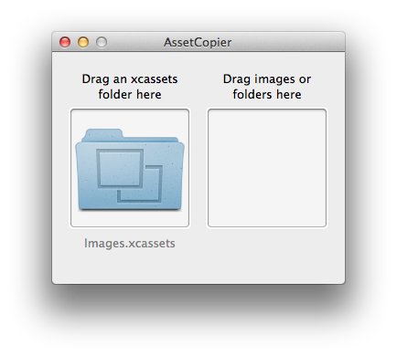

# AssetCopier

If you are frequently re-exporting the contents of the `.xcassets` folder in your iOS or OS X project, and find yourself frustrated at the tedium of replacing each asset one at a time, AssetCopier is for you. Drag images or folders of images in, and it will find images with the same name in the asset catalog, and copy them into the correct subfolder.

